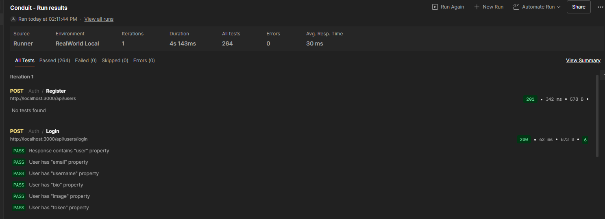

# RealWorld Blog API
A robust RESTful API implementation of the RealWorld spec using Spring Boot.

## 📚 RealWorld Spec
This project implements the [RealWorld API specification](https://realworld-docs.netlify.app/specifications/backend/introduction/), ensuring compatibility with any RealWorld frontend implementation.

## 🚀 Live Demo
- **Interactive API Docs (Swagger):** https://realworld-blog-production.up.railway.app/swagger-ui.html
- **API:** https://realworld-blog-production.up.railway.app/api
- **Quick Test:** https://realworld-blog-production.up.railway.app/api/tags

## 🛠️ Tech Stack
- Java 17
- Spring Boot 3.x
- Spring Security + JWT
- Spring Data JPA
- H2 Database
- Maven

## ✨ Features
- User authentication & authorization with JWT
- CRUD operations for articles
- Follow/unfollow users
- Favorite articles
- Comment system
- Tag filtering

  ## 💡 Key Learning Outcomes
- RESTful API design following industry standards
- JWT-based authentication and authorization
- Database relationships with Spring Data JPA
- Exception handling and validation
- API deployment with Railway
- Version control with Git/GitHub

## 🧪 Testing the API
✅ All RealWorld API spec tests pass



### Run Tests Locally
1. Import the [Postman collection](https://github.com/gothinkster/realworld/tree/main/api)
2. Set environment variable: `APIURL = http://localhost:3000/api`
3. Run collection - all tests pass ✅

### Browser Test
Visit: https://realworld-blog-production.up.railway.app/api/tags

### Example API Requests

**Register a new user:**
```bash
curl -X POST https://realworld-blog-production.up.railway.app/api/users \
  -H "Content-Type: application/json" \
  -d '{"user":{"username":"testuser","email":"test@example.com","password":"password123"}}'
```

**Login:**
```bash
curl -X POST https://realworld-blog-production.up.railway.app/api/users/login \
  -H "Content-Type: application/json" \
  -d '{"user":{"email":"test@example.com","password":"password123"}}'
```

**Get all articles:**
```bash
curl https://realworld-blog-production.up.railway.app/api/articles
```

## 🏃 Running Locally

```bash
git clone https://github.com/EndOfEntropy/RealWorld-Blog
cd RealWorld-Blog
mvn spring-boot:run
```
The API will be available at http://localhost:3000/api
Swagger UI will be available at http://localhost:3000/swagger-ui.html

## 📋 API Endpoints
All endpoints are documented and testable via Swagger UI. Main endpoints include:
Authentication:

POST /api/users - Register user
POST /api/users/login - Login user
GET /api/user - Get current user
PUT /api/user - Update user

Profiles:

GET /api/profiles/:username - Get profile
POST /api/profiles/:username/follow - Follow user
DELETE /api/profiles/:username/follow - Unfollow user

Articles:

GET /api/articles - List articles
POST /api/articles - Create article
GET /api/articles/:slug - Get article
PUT /api/articles/:slug - Update article
DELETE /api/articles/:slug - Delete article
POST /api/articles/:slug/favorite - Favorite article
DELETE /api/articles/:slug/favorite - Unfavorite article

Comments:

GET /api/articles/:slug/comments - Get comments
POST /api/articles/:slug/comments - Add comment
DELETE /api/articles/:slug/comments/:id - Delete comment

Tags:

GET /api/tags - Get tags

## 📝 License
MIT License

---

**Built with Spring Boot** | [View Source Code](https://github.com/EndOfEntropy/RealWorld-Blog)
